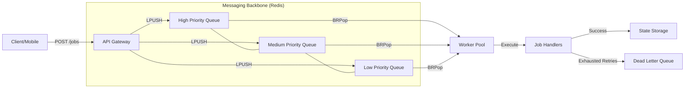

# Distributed Task Queue System

A production-ready, distributed task queue system built in Go. This project implements a robust architecture for handling asynchronous background jobs with strict priority, automatic retries, and comprehensive monitoring.

## 🏗 Architecture

The system is decoupled into independent microservices (API and Workers) communicating through a Redis backbone.



## 🚀 Key Features

- **Distributed By Design**: Decoupled API and Worker services allow independent scaling.
- **Strict Priority Queuing**: Workers prioritize `high` urgency jobs before processing `medium` or `low` via Redis-native priority polling.
- **Resilience & Fault Tolerance**:
  - **Exponential Backoff**: Failed jobs are automatically retried with increasing delays (`2^retry` seconds).
  - **Dead Letter Queue (DLQ)**: Jobs failing after maximum retries are moved to a separate queue for manual inspection.
  - **Safe Ack**: Jobs are tracked in a "processing" set until fully completed, preventing data loss during crashes.
- **Concurrency & Rate Limiting**: Internal worker pools with configurable global throughput limits (Tokens/sec).
- **Observability**:
  - **Swagger Documentation**: Interactive API documentation at `/swagger/index.html`.
  - **Metrics Engine**: Real-time stats for `active_jobs`, `completed_jobs`, and `failed_jobs`.
- **Graceful Shutdown**: On `SIGINT/SIGTERM`, workers stop accepting new tasks and finish in-flight jobs un-cancelled.

## 🛠 Tech Stack

- **Languge**: Go (Golang)
- **Infrastructure**: Redis (Queue/Broker), Docker (Containerization)
- **Frameworks**: `swaggo` (OpenAPI), `redis/go-redis`

## 🏁 Getting Started

### 📦 Running with Docker (Recommended)

The easiest way to spin up the entire cluster (API, Workers, Redis) is using Docker Compose.

```bash
# 1. Build and start all services
docker-compose up -d --build

# 2. Check service logs
docker-compose logs -f
```

### 🚦 API Usage

Once running, the API is available at `http://localhost:8080`.

**Create a Job:**

```bash
curl -X POST http://localhost:8080/jobs \
  -H "Content-Type: application/json" \
  -d '{
    "type": "email",
    "priority": "high",
    "payload": {"to": "recruiter@example.com", "subject": "Hire me!"}
  }'
```

**Check System Health:**

```bash
curl http://localhost:8080/metrics
```

**Interactive Docs:**
Navigate to `http://localhost:8080/swagger/index.html`

---

## 🔥 Scaling Workers

Scale the processing layer horizontally with a single command:

```bash
# Scale to 5 worker containers instantly
docker-compose up -d --scale worker=5
```

## 🧪 Load Testing

A benchmark script is included to test throughput using `ab` (Apache Benchmark):

```bash
./scripts/benchmark.sh
```
