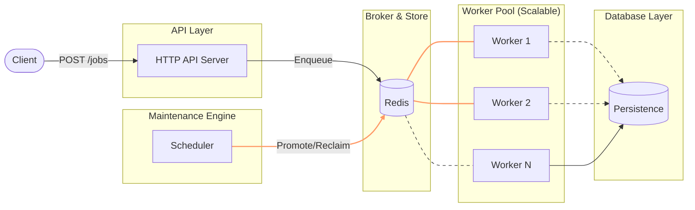

# 🚀 Go Distributed Task Queue

A production-ready, horizontally scalable, and pluggable distributed task queue system built in Go. Designed for high availability, transactional consistency, and architectural flexibility.

---

## 🏗️ Architecture



---

## ✨ Key Features

- **🛡️ Atomic Visibility Timeouts**: Uses Redis Sorted Sets (`ZSET`) to ensure no job is ever processed by two workers simultaneously, with automatic reclamation for stalled workers.
- **🔌 Pluggable Architecture**: Add new job types (Email, Image Processing, etc.) without touching the core engine via a dynamic `init()` based plugin registration system.
- **📈 Horizontal Scaling**: Workers are fully stateless. Spin up 1 or 100 instances flawlessly using standard orchestration.
- **🔄 Smart Retries**: Built-in exponential backoff (2ⁿ seconds) to handle transient failures gracefully.
- **📬 Dead Letter Queue (DLQ)**: Failed tasks are preserved with full stack traces/error messages for manual inspection.
- **📊 Real-time Observability**: JSON structured logging, `/metrics` endpoint for Prometheus, and a `/workers` health registry.
- **🛡️ API Security**: Simple but effective X-API-Key middleware protection.

---

## 🛠️ Tech Stack

- **Core**: Go (Golang) 1.22+
- **Broker/Storage**: Redis (Optimised for atomic ops)
- **Database**: PostgreSQL (Persisted Audit Log)
- **Containerisation**: Docker & Docker Compose
- **Observability**: Structured `slog` (JSON), Swagger/OpenAPI

---

## 🚀 Getting Started

### 0. Quick Start (Interactive Demo)

The fastest way to see the system in action:

```bash
./demo.sh
```

This script boots the entire stack, submits immediate and scheduled jobs, and monitors the processing in real-time.

### 1. Run with Docker Compose

One command to start the API, Redis, and a pool of 3 workers:

```bash
docker-compose up --build --scale worker=3
```

### 2. Submit a Job (CLI)

Use our pre-built CLI tool for easy testing:

```bash
./tq submit --type email --payload '{"to":"recruiter@top-tier.com"}'
```

### 3. Submit a Job (cURL)

```bash
curl -X POST http://localhost:8080/jobs \
     -H "X-API-Key: secret-api-key" \
     -H "Content-Type: application/json" \
     -d '{"type":"email","payload":{"to":"user@example.com"},"priority":"high"}'
```

---

## ⚖️ Scaling & Performance

### Horizontal Scalability

This system is architected to be **Shared-Nothing**. Workers do not communicate with each other. They interact solely with the centralized Redis broker using atomic operations (`ZADD`, `LPOP`, `TXPipeline`).

**To scale processing power:**

1. Simply increase the `replicas` in Kubernetes or the `--scale` flag in Docker Compose.
2. New workers will automatically register their heartbeats and begin competing for available tasks in the queue.
3. No configuration changes are required on the API or existing workers.

### Performance Benchmarking

A high-concurrency stress test script is included:

```bash
# Fire 1000 jobs with 50 concurrent connections
./scripts/load_test.sh 1000 50
```

---

## 📁 Project Structure

- `/cmd`: Entry points for API, Worker, and CLI.
- `/internal/queue`: Core Redis broker implementation with atomic visibility logic.
- `/internal/worker`: Lifecycle management, plugin registry, and processing loops.
- `/internal/jobs`: Extensible job plugin implementations.
- `/internal/api`: HTTP routes, handlers, and middlewares.
- `/docs`: Swagger 2.0 API documentation.

---

## 🛠️ Development

### Generate Swagger Docs

```bash
swag init -g cmd/api/main.go
```

### Run Tests

```bash
go test ./...
```

---

## 📈 Kubernetes Autoscaling (HPA)

The worker pool supports dynamic scaling based on real-time queue depth and worker utilization.

This service already exposes Prometheus metrics on `/metrics`, including: - `task_queue_length{queue,tenant_id}` - `task_queue_worker_busy_ratio`

### 1. Prerequisites

- **Prometheus**: Collected metrics from `/metrics`.
- **Prometheus Adapter**: Installed in your cluster to expose custom metrics to the K8s API.

### 2. Implementation Steps

1. **Configure Prometheus Adapter**: Apply the rules found in [prometheus-adapter-config.yaml](deploy/k8s/prometheus-adapter-config.yaml). This maps the internal `task_queue_length` and `worker_busy_ratio` metrics to the K8s External Metrics API.
2. **Deploy HPA**: Apply the [hpa.yaml](deploy/k8s/hpa.yaml) manifest:
   - **Scale Up**: Triggered when the average queue length exceeds **100** pending jobs.
   - **Scale Down**: Triggered when worker utilization drops below **20%** for more than **3 minutes**.
   - **Range**: Scales between **2** and **20** replicas.

```bash
kubectl apply -f deploy/k8s/hpa.yaml
```

### 3. Example Prometheus Adapter install

If you have not installed Prometheus Adapter, use Helm:

```bash
helm repo add prometheus-community https://prometheus-community.github.io/helm-charts
helm repo update
helm upgrade --install prometheus-adapter prometheus-community/prometheus-adapter \
    --namespace monitoring --create-namespace
```

Then merge the `deploy/k8s/prometheus-adapter-config.yaml` rules into the adapter values under `rules.external`.
